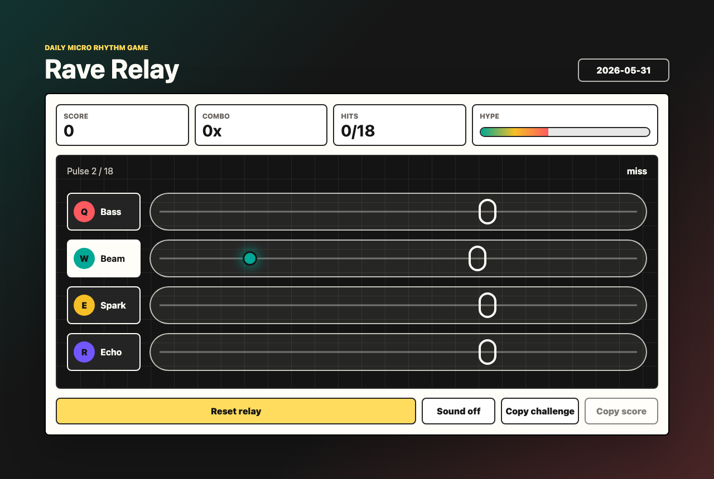

# Rave Relay

Rave Relay is a tiny browser rhythm sprint: four colored lanes send daily seeded pulses, and the player tries to catch each pulse on the ring before the relay drops.

It is built as a static, dependency-free HTML/CSS/JavaScript game so it opens instantly on desktop or mobile.



## Why it is fun

- A full run is 18 pulses, so one attempt takes less than a minute.
- The daily setlist is deterministic, which makes scores easy to compare.
- Timing grades, combo bonuses, a hype meter, local best score, and copyable results make repeat plays feel worthwhile.
- Seeded challenge links make any date replayable with `?date=YYYY-MM-DD`.
- It supports mouse, touch, and Q/W/E/R keyboard play without login, install steps, or remote services.

## Why it may be worth a star

Rave Relay is small enough to read in one sitting but polished enough to share: no build stack, no external art, no accounts, responsive layout, deterministic daily content, copyable challenge links, and a clear score loop. It is a reusable pattern for tiny web games that feel complete instead of prototype-shaped.

## What it can do

- Start a daily seeded 18-pulse relay.
- Score taps as perfect, nice, catch, miss, or wrong lane.
- Track score, combo, hits, hype, grade, and local best score.
- Copy the current daily challenge link before playing.
- Copy a compact result string for sharing.
- Play optional synthesized tones after a user gesture.

## How to run

Open `index.html` directly, or serve the folder locally:

```sh
npm run check
npm test
npm run verify:browser
python3 -m http.server 5212
```

Then visit `http://localhost:5212/`.

Replay or share a specific setlist with `?date=YYYY-MM-DD`, for example:

```text
https://bte808.github.io/fun-20260531-a-rave-relay/?date=2026-05-31
```

For the full local release check, run:

```sh
npm run validate
git diff --check
```

`npm run verify:browser` starts a temporary local server, opens headless Chrome at desktop and `390 x 844` mobile sizes, starts a relay, taps the active lane, captures screenshots, and fails if the page has obvious horizontal overflow.

## Core gameplay

1. Press **Start relay**.
2. Catch the active lane pulse when it crosses the bright ring.
3. Build combo by landing clean hits.
4. Copy the date challenge before a run, or finish all 18 pulses and copy the final score.

Lane controls:

- Bass: Q or tap the Bass button.
- Beam: W or tap the Beam button.
- Spark: E or tap the Spark button.
- Echo: R or tap the Echo button.

## Inspiration

The idea came from browsing recent public web inspiration around tiny browser-first fun: Show HN had playful web experiences such as a browser rave and a 60-second game, while Product Hunt's games topic highlighted the appeal of low-friction games that exist mostly for joy. Rave Relay borrows only that broad interaction shape: a short, original, browser-native play loop with no copied code, art, text, or protected assets.

## Future extensions

- Add an optional hard mode with narrower timing windows.
- Add a visual replay strip for missed pulses.
- Add more audio voices while keeping the no-asset approach.

## License

MIT
